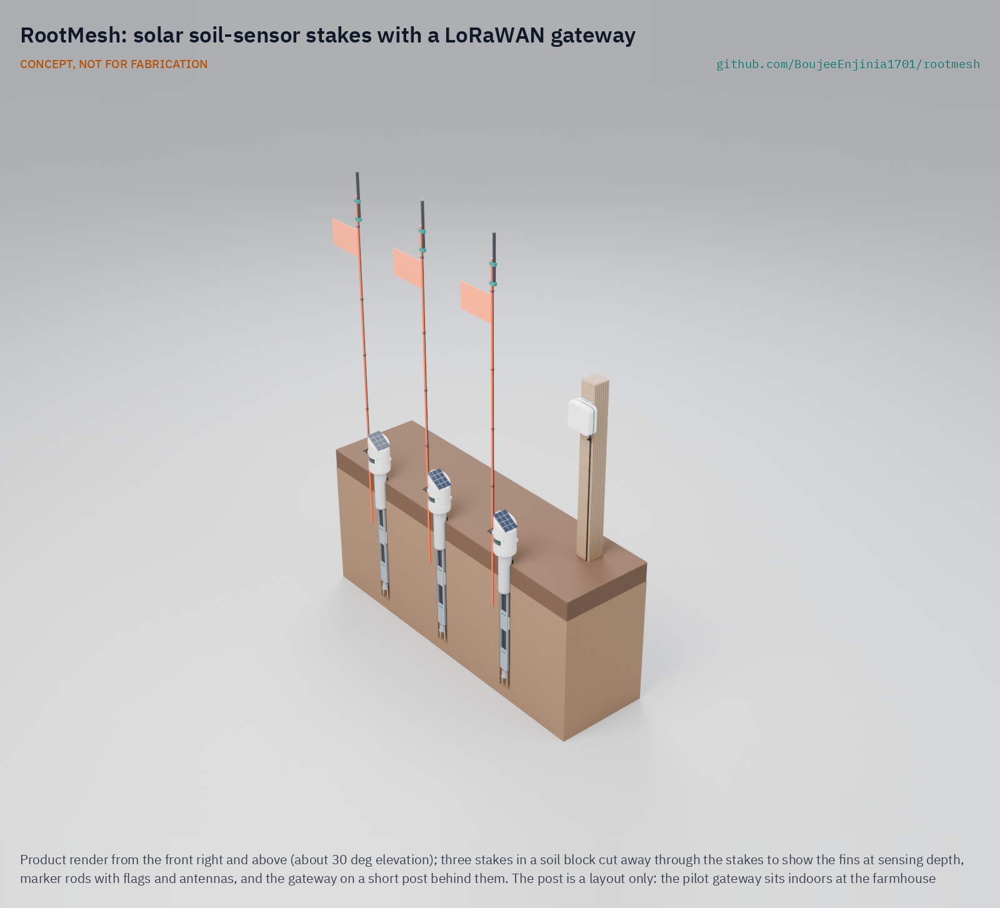
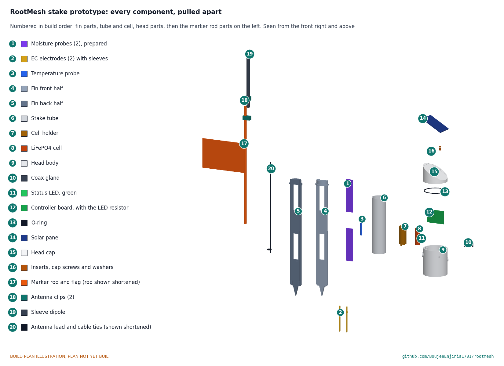

# RootMesh

     

**Area:** Agriculture · **TRL:** 3 of 9 (proof of concept on paper) · **Value-engineering target:** USD 300 (estimated cost USD 281.45) · **Difficulty:** 2 of 5

Solar-powered stakes that measure soil moisture, temperature and EC and report over LoRa to a single gateway and dashboard.

*The gateway on a post in this render is a layout only; the pilot gateway is indoors.*

[Exploded render](media/render-exploded.png) · [Detail render](media/render-detail.png) · [Interactive 3D model](media/viewer.html) · [Concept blueprint (PDF)](media/concept-blueprint.pdf) · [General arrangement RMS-DWG-001 (PDF)](cad/drawings/RMS-DWG-001.pdf) · [Sizing calculations](docs/04-calcs/01-sizing.md) · [Prototype build plan](docs/05-build-plan.md) · [Design decisions](docs/06-design-decisions.md) · [Review note](docs/REVIEW.md)

## Concept rationale

Soil moisture only helps an irrigation decision if it is measured where the roots are, at more than one depth, and often enough to see the root zone drying between waterings. A buried stake with two capacitive probes, an EC pair and a temperature sensor answers that directly, and LoRaWAN lets one cheap gateway at the farmhouse collect a whole field without SIM cards or subscriptions. The stake sips about 2.6 mAh a day, so a palm-sized solar panel and a small LiFePO4 cell keep it running through a season with no battery changes.

RootMesh is open and garage-buildable because the growers who most need measured soil data are the ones least able to pay $150 to $600 a point for closed commercial nodes. Every part is a hobby-grade module, a hardware-store pipe or a printed piece, the known failure modes of cheap probes are designed out in the open, and a grower, extension office or school can build, repair and recalibrate the stakes without a vendor.

## Burning platform

In most regions of the world, more than 70 % of freshwater goes to agriculture ([World Bank, 2017](https://blogs.worldbank.org/en/opendata/chart-globally-70-freshwater-used-agriculture)), and irrigated land, about a fifth of cultivated area, grows about 40 % of the world's crops ([FAO, State of the World's Land and Water Resources, fast facts](https://www.fao.org/fileadmin/user_upload/newsroom/docs/en-solaw-facts_1.pdf)). Much of that water comes from aquifers that are falling: India, the largest groundwater user in the world, draws about 230 km³ a year, over a quarter of the global total, and more than 60 % of its irrigated agriculture depends on groundwater ([World Bank, 2012](https://www.worldbank.org/en/news/feature/2012/03/06/india-groundwater-critical-diminishing)).

Better timing is one of the cheapest levers. A systematic review of U.S. studies found that scheduling irrigation with soil water sensors used about 38 % less water than traditional scheduling, with similar or higher yields ([Datta and Taghvaeian 2023, *Agricultural Water Management*](https://www.sciencedirect.com/science/article/pii/S0378377423000136)). Yet field-ready wireless soil sensors still cost $150 to $600 or more per measurement point (see Problem below), which keeps them off most small farms.

## Where it could be used

### By industry

| Industry | Use |
| --- | --- |
| Vegetable and market gardening | Know when beds on drip or furrow irrigation are drying at 150 and 300 mm, and stop overwatering shallow-rooted crops |
| Orchards and vineyards | Track deep moisture and salinity through the season in a few representative blocks, and time deficit irrigation |
| Row and field crops | Place a few stakes per field or pivot to decide when to start an irrigation cycle |
| Agricultural extension and research | Deploy many low-cost points to map variation across soils and teach irrigation scheduling with real data |
| Urban and community gardens | Share one gateway across many plots and volunteers, with one dashboard for watering rotas |
| Parks, sports turf and landscaping | Skip scheduled watering when the root zone is still wet |

### By country or region

| Country or region | Why it matters there |
| --- | --- |
| India | The world's largest groundwater user; more than 60 % of irrigated agriculture depends on groundwater, and 29 % of assessed groundwater blocks were semi-critical, critical or overexploited in 2004 ([World Bank, 2012](https://www.worldbank.org/en/news/feature/2012/03/06/india-groundwater-critical-diminishing)) |
| Sub-Saharan Africa (for example Kenya) | Only about 4 % of land is irrigated, against 37 % in Asia ([IFPRI, 2010](https://www.ifpri.org/blog/irrigating-africa/)); new small-scale schemes need low-cost tools to make scarce water go further from the start |
| United States (High Plains) | Water levels in the High Plains aquifer fell by an area-weighted average of 16.5 ft (about 5.0 m) from predevelopment to 2019, a loss of about 286 million acre-feet of stored water ([USGS, 2023](https://pubs.usgs.gov/publication/sir20235143/full)) |
| Spain | Spain used about 16.7 billion m³ of irrigation water in 2010, about 42 % of the EU total ([European Parliamentary Research Service, 2019](https://www.europarl.europa.eu/RegData/etudes/BRIE/2019/644216/EPRS_BRI(2019)644216_EN.pdf)), and most of its freshwater abstraction goes to agriculture |
| Australia (Murray-Darling Basin) | The Basin accounted for 62 % of Australia's irrigation water use in 2020-21, about 4.9 million ML ([Australian Bureau of Statistics, 2022](https://www.abs.gov.au/statistics/industry/agriculture/water-use-australian-farms/latest-release)), where irrigators budget water against their entitlements |

## What sparked the idea

The idea traces back to the USDA's field guide *Estimating Soil Moisture by Feel and Appearance* (April 1998), which still underpins much irrigation scheduling advice. It asks growers to dig samples with a probe, auger or shovel in 1 ft increments down to the root depth at three or more sites per field, squeeze each one in the hand and match it to photographs, and says that with experience the method reaches about 5 % accuracy ([USDA NRCS](https://www.wcc.nrcs.usda.gov/ftpref/wntsc/waterMgt/irrigation/EstimatingSoilMoisture.pdf)). RootMesh keeps the same logic, several sites and more than one depth in the root zone, but leaves the probes in the ground and sends the readings to the farmhouse every 20 minutes, so the sampling happens without the walk and the guesswork.

## Problem

Irrigation decisions rely on guesswork without cheap, field-hardy soil sensing. Commercial wireless soil nodes cost about $150 to $600 or more per measurement point, and the cheap hobby probes corrode and drift when buried.

## Concept

Solar-powered stakes that measure soil moisture, temperature and EC and report over LoRa to a single gateway and dashboard. Each stake reads water content at 150 mm and 300 mm, bulk EC and soil temperature every 20 min, runs on a 0.5 W panel and a small LiFePO4 cell, carries its antenna at about 1 m on the flagged marker rod, and costs about $59.15 in parts. A pilot set of three stakes, an indoor US915 gateway and a steel slot tool that pre-cuts the fin path is $281.45 (indicative), USD 18.55 under the USD 300 value-engineering target.

The sizing note [RMS-CAL-001](docs/04-calcs/01-sizing.md) finds 8 of 14 requirements met on paper and 5 at risk: moisture accuracy, range through tall crops, head and cell temperature in bare hot soil, installation in firm dry soil and probe life. The parametric model is `cad/src/model.py` (STEP and STL in `cad/step` and `cad/stl`).

Full design precis: [docs/02-concept.md](docs/02-concept.md)

## Key components

- Two capacitive moisture probes (sealed, TLC555 conversion) in a printed sensor fin
- DS18B20 temperature probe
- Stainless EC electrodes with AC excitation
- LoRaWAN module (Seeed Wio-E5, STM32WLE5) with solar charger
- Sleeve dipole antenna at about 1 m on the marker rod
- 600 mAh LiFePO4 cell below grade
- 0.5 W PV panel on a printed ASA head over a PVC stake tube
- Indoor LoRaWAN gateway on The Things Network and an open-source dashboard
- Steel slot tool with a depth stop, one per set, to pre-cut the fin path before installation

The working bill of materials is in [bom/bom.csv](bom/bom.csv).

## Building the prototype

The [prototype build plan](docs/05-build-plan.md) (RMS-BLD-001) shows, in pictures, how to make each of the nineteen stake components and the slot tool and put them together in sixteen steps; nothing has been built yet. The made parts are a sensor fin printed in two glued halves, a printed head body and cap, a printed cell holder and antenna clips, a cut PVC tube, two stainless electrodes and a steel slot tool; the electronics are bought modules wired at block level. Writing the plan made the design buildable: the head now has a removable cap sealed by an O-ring so the board can go in, the fin has slots, pockets and wire channels for its sensors and a collar the tube sits on, and the cell, antenna and slot tool handle have real fixings (RMS-DDR-003, open for Amish's review). Every picture is drawn from the model, and the model checks that each part touches what it should and clears what it should not.

## Repository layout

| Folder | Contents |
| --- | --- |
| `docs/` | Problem, concept, requirements, calculations and design decisions |
| `cad/src/` | build123d Python source, the source of truth for all geometry |
| `cad/step/`, `cad/stl/` | Exported models for FreeCAD, other CAD tools and printing |
| `cad/drawings/` | 2D sketches and dimensioned drawings |
| `bom/` | Bill of materials |
| `electronics/` | KiCad schematics and PCB layouts |
| `firmware/` | Microcontroller code |
| `media/` | Renders, perspectives and photos |
| `build-log/` | Dated prototyping notes |

## Documentation

Controlled documents follow the portfolio [documentation standard](.kit/STANDARDS.md). Each carries a document ID (RMS-PRC-001 for the precis), a version and a revision history. Branded PDFs are built with `python .kit/render.py` and attached to GitHub Releases when a document is tagged, for example `RMS-PRC-001/v1.0`.

## Credits

Designed by Amish Chadha. See [CONTRIBUTORS.md](CONTRIBUTORS.md) for roles. To cite this design, use [CITATION.cff](CITATION.cff) (GitHub shows it as "Cite this repository").

AI assistance (Claude) was used to accelerate concept renders, prototype documentation and first-pass sizing calculations. Design direction and all decisions are Amish Chadha's, recorded in this repository's decision records (`docs/decisions/`).

## Licenses

- **Hardware** (CAD, drawings, BOM, electronics): [CERN-OHL-S v2](LICENSE)
- **Software** (firmware, scripts, notebooks): [MIT](LICENSE-SOFTWARE)

A project of the [Design Molecule](https://designmolecule.com) lab.
