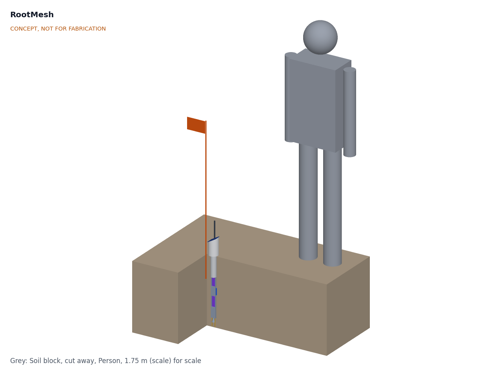
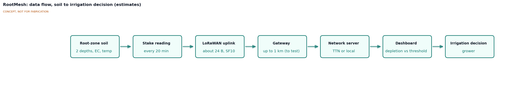
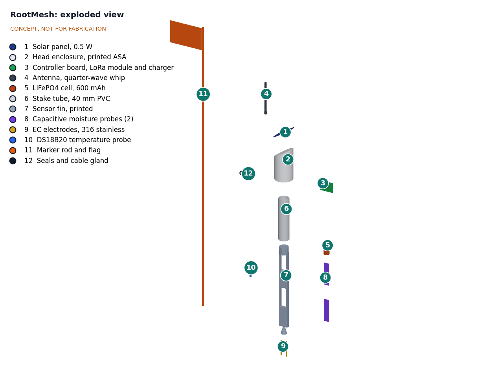
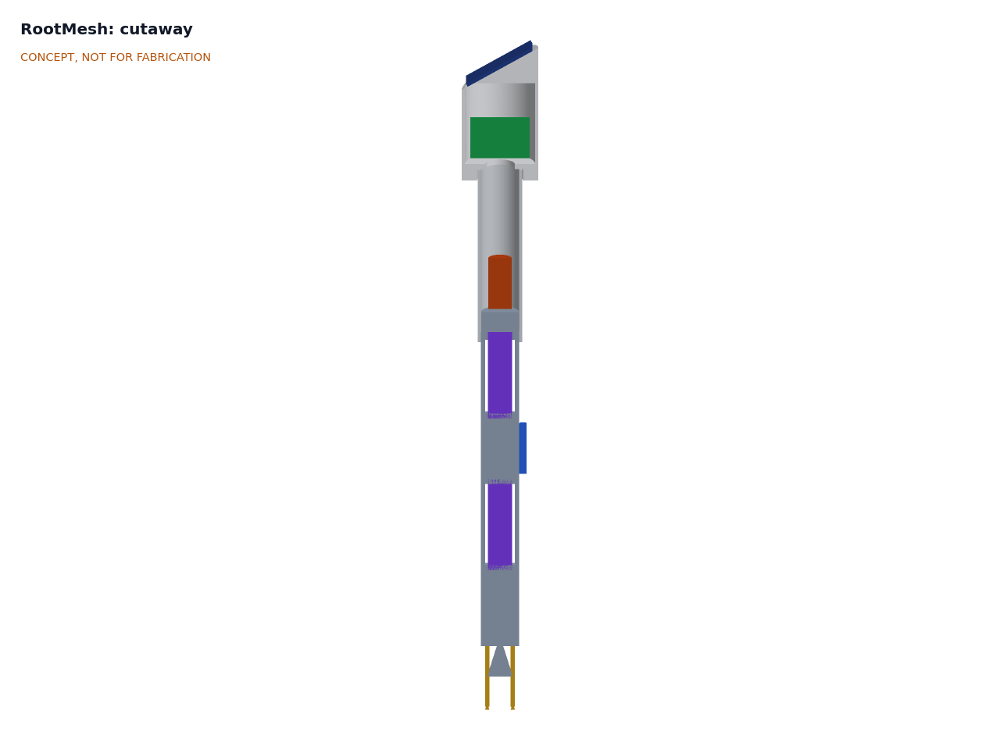

# RootMesh design precis

RootMesh is a hand-installed soil sensor stake that measures volumetric water content at 150 mm and 300 mm, bulk EC and soil temperature, and reports every 20 min over LoRaWAN to one gateway at the farmhouse, from which an open dashboard shows root-zone depletion against a threshold the grower sets. First-order numbers suggest a stake uses about 2 mAh per day, so a 0.5 W panel harvests about 70 times its daily need and a 600 mAh LiFePO4 cell alone lasts about 240 days. A stake costs about $52 in parts and a pilot set of three stakes and a gateway about $246, within the $300 budget. The weak points are radio range from a stake antenna close to the ground to an indoor gateway (R5, likely not met at 1 km), moisture accuracy (R1) and probe life in wet soil (R14), all unverified.

*Figure 1. One RootMesh stake installed in soil, shown with the soil cut away, a marker flag and a 1.75 m person for scale.*

## How it works

1. **Sense.** Every 20 min the controller switches on the sensors for about 1 s. Two capacitive probes, held edge-on in windows of a printed fin, read water content at 150 mm and 300 mm. A DS18B20 on the fin edge reads soil temperature at about 225 mm. Two stainless electrodes below the fin tip read bulk EC with a short AC burst, so the electrodes do not polarize.
2. **Report.** The LoRaWAN module sends an 11 byte payload (24 bytes on air) at the slowest data rate the link needs, SF10 in the design case, then sleeps.
3. **Collect.** An indoor 8-channel gateway at the farmhouse forwards packets over Wi-Fi to a network server: The Things Network's free community server by default, or a local server.
4. **Decide.** An open-source dashboard converts probe readings to water content with the site calibration, shows depletion between field capacity and the grower's refill point (the FAO-56 "management allowed depletion" idea; [Allen et al. 1998](https://www.fao.org/4/x0490e/x0490e00.htm)), and flags when the shallow or deep reading crosses it. Two depths show whether irrigation water has reached the lower root zone.
5. **Power.** A 0.5 W panel on the sloped head charges a 600 mAh LiFePO4 cell kept about 60 mm below grade, where the soil keeps it cooler in summer and milder in winter than the head.

*Figure 2. Data flow from the root zone to the irrigation decision. Interval, payload and range values are estimates.*

## Main components

Numbers match the exploded view (Figure 3) and `bom/bom.csv`.

| # | Component | Proposed choice | Notes |
| --- | --- | --- | --- |
| 1 | Solar panel | 5 V, 0.5 W, about 70 x 50 mm, on a 30 degree slope | Self-cleaning slope sheds rain and dust |
| 2 | Head enclosure | Printed ASA cup, 72 mm diameter, O-ring socket over the tube | ASA for UV and heat; PETG softens near 70 °C |
| 3 | Controller board | STM32WLE5-class LoRaWAN module (for example Seeed Wio-E5, about $7; [Seeed Studio](https://www.seeedstudio.com/LoRa-E5-Wireless-Module-p-4745.html)) on a carrier with a LiFePO4 solar charger with NTC cut-off, a sensor power switch and the EC drive | One chip for radio and application; module choice proposed, awaiting Amish |
| 4 | Antenna | Quarter-wave whip beside the panel, tip about 270 mm above grade | Moving it up the marker rod is a proposed option (see link budget) |
| 5 | LiFePO4 cell | 14500, 3.2 V, 600 mAh (about 1.9 Wh), PTC fuse | Inside the tube below grade |
| 6 | Stake tube | 42 mm OD PVC pressure pipe, 170 mm | Carries the cable and the cell; the head and fin plug into it |
| 7 | Sensor fin | Printed carrier 36 x 12 mm in section, 310 mm long, two windows, pointed tip | Pushed into undisturbed soil below the auger hole |
| 8 | Capacitive moisture probes (2) | v1.2-class boards with the NE555 replaced by a TLC555 and the edges sealed in epoxy, read as frequency | Fixes from the [Cave Pearl Project](https://thecavepearlproject.org/2020/10/27/hacking-a-capacitive-soil-moisture-sensor-for-frequency-output/) |
| 9 | EC electrodes | Two 316 stainless rods, 4 mm diameter, 24 mm apart | Two-electrode, AC excitation; cell constant set by calibration |
| 10 | Temperature probe | DS18B20 in a 6 mm stainless sheath, ±0.5 °C from -10 to 85 °C ([SparkFun](https://www.sparkfun.com/temperature-sensor-waterproof-ds18b20.html)) | Also compensates EC and moisture readings |
| 11 | Marker rod and flag | 1.2 m fiberglass rod pushed in beside the stake | Visibility for machinery and people |
| 12 | Seals and consumables | O-ring, IP68 gland, desiccant, potting | |
| 13 | LoRaWAN gateway | Indoor 8-channel gateway with Wi-Fi (The Things Indoor Gateway class, about $79 to $90; [Seeed Studio](https://www.seeedstudio.com/The-Things-Indoor-Gateway-EU-p-4709.html)) | Not in the exploded view; choice proposed, awaiting Amish |
| 14 | Dashboard | Open-source (for example Node-RED or Grafana) on an existing computer | Not in the exploded view |

*Figure 3. Exploded view of one stake with numbered callouts matching the BOM. The gateway and dashboard are not shown.*

*Figure 4. Section through the stake: controller board in the head, cell in the tube below grade, moisture probes in the fin windows, temperature probe on the fin edge and EC electrodes below the tip. The marker rod and antenna are omitted for clarity.*

## First-order numbers

All values are estimates for concept review and will be checked at TRL 3.

### Airtime

Assumptions: 11 byte application payload plus 13 bytes of LoRaWAN overhead, 125 kHz bandwidth, coding rate 4/5, 8 symbol preamble, explicit header and CRC; time on air from the standard Semtech formula.

| Spreading factor | Time on air per uplink | Per day at 20 min (72 uplinks) | Per day at 15 min (96 uplinks) |
| --- | --- | --- | --- |
| SF7 | about 62 ms | about 4 s | about 6 s |
| SF9 | about 206 ms | about 15 s | about 20 s |
| **SF10 (design case)** | **about 371 ms** | **about 27 s** | **about 36 s, over the 30 s fair use limit** |
| SF12 (EU868 only) | about 1.48 s | about 107 s | about 142 s |

At SF10 a 20 min interval fits The Things Network's 30 s per day fair use limit ([The Things Network](https://www.thethingsnetwork.org/docs/lorawan/duty-cycle/)); 15 min does not. With adaptive data rate, stakes close to the gateway will use SF7 to SF9 and could report every 10 to 15 min. The duty cycle in the EU868 1 % sub-bands allows about 36 s per hour, far above this use.

### Energy

Assumptions: sensors powered for 1 s at about 12 mA; microcontroller active 1.5 s at about 4 mA; transmit 0.37 s at about 120 mA (order of magnitude for an SX126x-class radio at +20 to +22 dBm, to be confirmed from the chosen module's datasheet); two receive windows 0.2 s at about 5 mA; sleep current about 10 µA for the whole board including the charger; 30 % margin.

| Quantity | Estimate | Basis | Requirement |
| --- | --- | --- | --- |
| Charge per report | about 63 mAs | 12 + 6 + 44 + 1 mAs | |
| Reports per day | 72 | Every 20 min | R4 |
| Active charge per day | about 1.3 mAh | 72 x 63 mAs | |
| Sleep charge per day | about 0.24 mAh | 10 µA x 24 h | |
| **Daily use with margin** | **about 2.0 mAh (about 6.4 mWh)** | 1.5 mAh x 1.3 | |
| Days on the cell alone | about 240 | 600 mAh x 80 % usable / 2.0 mAh | R6 (90 days) met |
| Harvest, 3 sun hours, open sky | about 150 mAh per day | About 100 mA panel current x 3 h x 50 % for tilt, dust, heat and linear charging | |
| Harvest to use ratio | about 70 times, about 7 times under a canopy passing 10 % of light | | R6 met on estimate |

The energy budget has large margin. That also means the panel is not strictly needed: a primary lithium cell would run a stake for years, which is how the Dragino LSE01 works ([Dragino](https://www.dragino.com/products/lora-lorawan-end-node/item/159-lse01.html)). Solar with a small rechargeable cell is kept because it matches the pitch, avoids disposable cells and allows faster reporting, but this is a pitch-level choice (see Key design choices).

### Radio link

Assumptions: 868 MHz; stake transmits +14 dBm ERP (EU868 limit) with a 0 dBi whip; gateway sensitivity about -132 dBm at SF10 (typical SX12xx figure); 12 dB loss through the farmhouse wall and window; 10 dB margin for crop foliage and fading; two-ray ground reflection path loss, 40 log d - 20 log(h_t h_r), valid beyond about 20 to 110 m for these heights.

| Case | Path loss at 1 km | Loss budget available | Margin |
| --- | --- | --- | --- |
| Stake antenna 0.2 m, indoor gateway at 3 m | about 124 dB | 146 - 12 - 10 = 124 dB | **about 0 dB, R5 not met** |
| Stake antenna 0.2 m, outdoor gateway on a 6 m mast | about 118 dB | 146 - 10 = 136 dB | about 18 dB |
| Stake antenna at 1 m on the marker rod, indoor gateway at 3 m | about 110 dB | 124 dB | about 14 dB |

The indoor gateway alone is marginal at 1 km. Two cheap fixes each give over 10 dB: raise the stake antenna to the top of the marker rod with a short coax (about $4 a stake), or move the gateway antenna outdoors. In the US915 plan the stake may transmit up to +20 dBm, which adds about 6 dB. Real range needs a field walk test at TRL 4.

### Measurement

- **Moisture.** Capacitance sensors respond to water, EC and temperature, more so at lower frequencies ([Kizito et al. 2008](https://www.sciencedirect.com/science/article/abs/pii/S0022169408000462)). Site-specific calibration cuts error to about one third of factory calibration ([Datta and Taghvaeian 2023](https://www.sciencedirect.com/science/article/pii/S0378377423000136)). The plan is a two-point field calibration (after irrigation to field capacity, and at a dry reading with a gravimetric sample) plus temperature correction from the DS18B20. Whether ±3 % VWC (R1) is reachable is unverified.
- **Air gaps.** A capacitive probe reads mostly the few millimeters of soil next to its surface, so any gap from installation reads as dry soil. The fin pushes into undisturbed soil below the auger hole to avoid this; contact quality is the largest measurement risk.
- **EC.** Bulk EC depends on moisture as well as salinity. Crop salinity thresholds in FAO-29 ([Ayers and Westcot 1985](https://www.fao.org/4/t0234e/t0234e00.htm)) use saturated-paste EC, so the dashboard should show EC as a trend and a pore-water estimate, not as a direct threshold. Readings are corrected to 25 °C at about 2 % per °C.

### Cost

| Group | Indicative cost | Requirement |
| --- | --- | --- |
| One stake (items 1 to 12) | about $52 | R12 ($60) met |
| Three stakes | about $156 | |
| Gateway (item 13) | about $90 | |
| **Pilot set** | **about $246** | R12 ($300) met |
| Reference: Dragino SE01 node | about $151 to $170 per point ([Choovio](https://www.choovio.com/product/se01-lb-lorawan-soil-moisture-ec-sensor/)) | |

## Key design choices

Every choice below is **Proposed, awaiting Amish**.

- **Solar with a rechargeable LiFePO4 cell, or a primary cell.** Option A: 0.5 W panel and a 600 mAh LiFePO4 cell (keeps the pitch, no disposable cells, allows faster reporting; adds a charger, a panel to keep clean and a cell that must not charge when frozen). Option B: a primary Li-SOCl2 cell with no panel (simpler, sealed, multi-year life at 20 min; changes the "solar-powered" pitch and leaves a hazardous cell to dispose of). Recommendation: A. Proposed, awaiting Amish.
- **LiFePO4 rather than Li-ion.** LiFePO4 tolerates heat better and is less prone to thermal runaway; it costs a little more capacity per volume. Recommendation: LiFePO4. Proposed, awaiting Amish.
- **Two moisture depths on one fin.** Two depths show whether water reached the lower root zone, at about $3 extra per stake. The alternative is one depth, as most low-cost nodes use. Recommendation: two depths. Proposed, awaiting Amish.
- **Hacked hobby capacitive probes rather than a commercial FDR or TDR probe.** Keeps the stake near $50; accuracy and life are the risks (R1, R14). Recommendation: hacked probes at TRL 2 and 3, with one commercial reference sensor borrowed for calibration later. Proposed, awaiting Amish.
- **LoRaWAN on The Things Network by default.** Free and simple; the fair use limit sets the 20 min interval at SF10, and a TTIG-class gateway works only with The Things Stack. The alternative is a Raspberry Pi gateway with a local ChirpStack server (fully local data, about $60 to $100 more). Recommendation: TTN for the pilot, local option documented later. Proposed, awaiting Amish.
- **Indoor gateway, plus antenna on the marker rod.** The link budget shows the indoor gateway is marginal at 1 km. Option A: keep the indoor gateway and raise the stake antenna to 1 m on the marker rod (about $4 a stake; adds a cable and a snag point). Option B: outdoor gateway on a mast (better coverage for many stakes; about $150 to $250 more, which would exceed the pilot budget). Option C: accept shorter range (about 500 m). Recommendation: A for the pilot. The model and BOM show the whip on the head until this is decided. Proposed, awaiting Amish.
- **Default interval 20 min.** Fits the fair use limit at SF10; faster with adaptive data rate near the gateway. Proposed, awaiting Amish.
- **Pilot set of three stakes and one gateway as the reading of the $300 budget.** Proposed, awaiting Amish.

## Safety

> **Safety:** Each stake holds a small lithium cell in a sealed enclosure buried in wet soil and exposed to sun, frost and machinery. The hazards are small but real.

- **Lithium cell.** A LiFePO4 cell of about 1.9 Wh is far less energetic than a phone battery, but a shorted or crushed cell can still overheat and vent. Fuse the cell (PTC), use a charger with an NTC input that blocks charging below 0 °C and above 45 °C, never charge a swollen or water-damaged cell, and do not leave stakes with cells in a closed hot vehicle. Plated lithium from charging below freezing can cause internal shorts later.
- **Sealed enclosure pressure.** A sealed head in sun and soil warms and cools daily; trapped water plus heat can build small pressures and pump moisture in. Use a desiccant and consider a vent membrane.
- **Machinery and trips.** A stake struck by a tractor, mower or tiller can be thrown or can damage the implement; a low stake is a trip hazard. The flagged marker rod is part of the design, and stakes should be pulled before tillage.
- **Sharp parts.** The fin tip and stainless electrodes are pointed; handle and store with tip covers, and keep away from children and livestock.
- **Chemicals and electrical.** Epoxy potting and conformal coating need gloves and ventilation. The stake runs at 3.2 V and carries no shock hazard; the gateway plugs into mains indoors through its own certified USB supply.
- **Data is not advice.** Readings inform a grower's decision. A failed or badly calibrated stake can read wet when the soil is dry, so growers should keep checking the crop, especially while the system is new.

## Open questions for TRL 3

- Confirm the power and pitch choice (solar LiFePO4 or primary cell) with Amish.
- Close the link budget: antenna on the marker rod, outdoor gateway or shorter range; check US915 versus EU868 for the first users.
- Define the field calibration routine and estimate its error for two soils (R1).
- Size the EC circuit: excitation frequency, reference resistor, cell constant and temperature correction (R3).
- Choose a sealing method for the probe edges and connectors that lasts 12 months buried (R14).
- Check the head temperature in full sun and whether a lighter head color or shade lip is needed (R9).
- Confirm the module's transmit and sleep currents from its datasheet and redo the energy budget.
- Choose first users and region for co-design.

Concept media: [blueprint sheet](../media/concept-blueprint.pdf), [interactive 3D model](../media/viewer.html).
